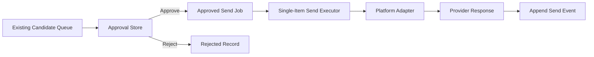

# Fortune Shrine Auto Send MVP

Status: architecture design only  
Scope: approved single-item sending

## Definition

“Auto Send MVP” means:

```text
The system performs the mechanical send only after a human has approved the exact
candidate, exact destination, and exact blessing.
```

It does not mean:

- automatic approval
- unattended operation
- continuous queue processing
- scheduled mass posting
- bulk sending
- automatic retry

The safer product name during implementation should be:

```text
Approved Send MVP
```

## Current Sending Status

The current V0.7 module is an assisted manual sender:

```text
Choose draft
→ open X post
→ extension attempts draft insertion
→ human clicks Reply
→ human manually marks sent
```

It already preserves an important safety boundary: the extension never sends.

However, the current record is not sufficient for a closed send loop because:

- there is no durable approval object
- there is no reject object
- the final send and the local sent mark are separate human actions
- no platform receipt is captured
- send history lacks attribution, candidate, blessing, and source IDs

## MVP Architecture



### Components

#### 1. Queue reader

Read existing candidate and blessing data. Do not modify search or generation.

#### 2. Approval store

Recommended files:

```text
approval-events.jsonl
approval-state.json
```

`approval-events.jsonl` is authoritative and append-only.

`approval-state.json` is a derived current-state index.

#### 3. Approved send job

Created only after a human approves.

```json
{
  "send_request_id": "sendreq_...",
  "candidate_id": "cand_...",
  "attribution_id": "atr_...",
  "blessing_id": "b_...",
  "exact_text": "Waiting can be long. May steadiness remain beside you.",
  "source": "X",
  "destination_post_id": "2068534613102759995",
  "destination_url": "https://x.com/traveler/status/2068534613102759995",
  "approved_at": "2026-06-21T18:03:00.000Z",
  "status": "approved"
}
```

#### 4. Send executor

Input:

```text
one approved send_request_id
```

Output:

```text
one sent, failed, or unconfirmed result
```

It must refuse:

- queued items
- rejected items
- modified text
- missing destination
- duplicate candidate sends
- expired approval
- unsupported platform

#### 5. Platform adapter

Adapter contract:

```text
validateDestination(job)
sendApprovedReply(job)
verifyReceipt(response)
normalizeResult(response)
```

Normalized result:

```json
{
  "ok": true,
  "status": "sent",
  "provider_message_id": "2068540000000000000",
  "provider_message_url": "https://x.com/FortuneShrine/status/2068540000000000000",
  "http_status": 201
}
```

### Platform scope

The first implementation should support one platform only.

Recommended first platform:

```text
X
```

Reason:

- current sender and queue are already X-oriented
- destination posts have stable IDs and URLs
- the browser extension already opens the correct public post
- a successful reply can have a public message ID and URL

The exact official X write permission, authentication mode, account tier, and
current platform automation terms must be verified immediately before
implementation. They are deployment prerequisites, not assumptions in this
design.

Polymarket should remain:

```text
unsupported
```

until an official, documented, account-safe method for posting comments is
confirmed. Browser DOM automation should not be generalized into an unsupported
Polymarket sender.

## Human Approval Contract

Approval must be explicit and per candidate.

Required approval snapshot:

```text
candidate identity
source post
exact blessing
blessing ID
destination platform
approval time
reviewer
Constitution check result
```

Approval expires if:

- the text changes
- the destination changes
- the source post is deleted or inaccessible
- the account identity changes
- the approval is older than the configured window

Recommended MVP approval lifetime:

```text
30 minutes
```

Fresh approval is required after expiry.

## Approve and Reject Interface Contract

No UI implementation is included in this task.

Required service operations:

```text
POST /approvals/:candidate_id/approve
POST /approvals/:candidate_id/reject
POST /send/:send_request_id
GET  /send/:send_request_id
```

Conceptual request:

```json
{
  "candidate_id": "cand_...",
  "blessing_id": "b_...",
  "exact_text_hash": "sha256:...",
  "reviewer": "human",
  "action": "approve"
}
```

Server-side rules:

- the server reloads the candidate
- the server recalculates the exact text hash
- the server verifies the candidate is not already sent
- the server records the decision
- Approve returns a `send_request_id`
- Reject never returns a send job

## Send Action Contract

The human performs a separate Send action after approval.

The server must display or return:

```text
username
destination URL
exact final text
approval time
source platform
```

The Send request contains only:

```text
send_request_id
```

It must not accept replacement message text. This prevents approved text from
being swapped at send time.

## Send Event

Minimum required fields:

```text
attribution_id
candidate_id
blessing_id
source
send_time
status
```

Recommended event statuses:

```text
approved
sending
sent
failed
unconfirmed
rejected
cancelled
```

Recommended storage:

```text
send-events.jsonl
```

One event is appended for each state change.

## Failure and Retry

### Failure

Record:

```text
error_category
provider_code
safe error message
failed_at
```

Categories:

```text
auth
permission
rate_limit
destination_missing
duplicate
network
provider_rejected
receipt_missing
unknown
```

### Retry

MVP has no automatic retry.

Retry flow:

```text
failed
→ human reviews the failure
→ human clicks Retry
→ approval is revalidated
→ one new send attempt
```

Rate-limit, authentication, account-warning, or visibility failures must disable
further sends until reviewed.

## Minimal Data Files

```text
/data/send/
  approval-events.jsonl
  approval-state.json
  send-events.jsonl
  send-state.json
```

No database, message queue, scheduler, or worker fleet is needed.

Serialize writes through one local process and use atomic replacement for state
indexes.

## Auto Approve Future Interface

MVP does not implement auto approval.

Reserve:

```text
approval_origin = human | policy
```

V1 accepted value:

```text
human
```

The future policy interface may return a recommendation, but the executor should
continue requiring:

```text
approval_origin=human
```

until a separately reviewed release changes the authorization rule.

## MVP Acceptance Criteria

1. Queue item cannot be sent before approval.
2. Approve freezes exact text and destination.
3. Reject creates no send job.
4. One Send click executes at most one approved job.
5. A successful provider response creates one `sent` event.
6. Duplicate clicks do not create duplicate replies.
7. Failed sends record a reason and do not retry automatically.
8. A changed blessing requires new approval.
9. An expired approval requires new approval.
10. Account warning, rate limit, or authentication failure stops execution.
11. Existing search and blessing generation remain unchanged.
12. Every sent event contains the six required attribution fields.

## Technical Difficulty

**Medium–High**

The state machine and file storage are straightforward. The higher difficulty is
safe platform execution:

- obtaining and maintaining write authorization
- guaranteeing idempotency
- distinguishing sent from unconfirmed
- protecting the account from repeated actions
- preserving human approval as a hard authorization boundary

## Estimated Development Time

For an X-only MVP with verified write access:

```text
Approval state and event storage     0.5–1 day
Blessing/candidate ID integration    0.5 day
Single-item send adapter             1–2 days
Receipt and idempotency handling     1 day
Failure stops and tests              1 day
```

Total:

```text
4–5 focused engineering days
```

If official X write permission is unavailable, browser-based send confirmation
would require additional investigation and should not be treated as equivalent to
an official API receipt.

## Minimum Implementation Sequence

1. Add candidate, blessing, and attribution IDs without sending.
2. Add append-only Approve/Reject events.
3. Add derived approval state.
4. Add one-item send executor behind explicit Send.
5. Implement only the verified X adapter.
6. Add provider receipt and public reply URL capture.
7. Add idempotency and duplicate-click tests.
8. Add account-risk circuit breakers.
9. Run five test-account sends.
10. Run twenty human-approved production sends before considering any scale.
