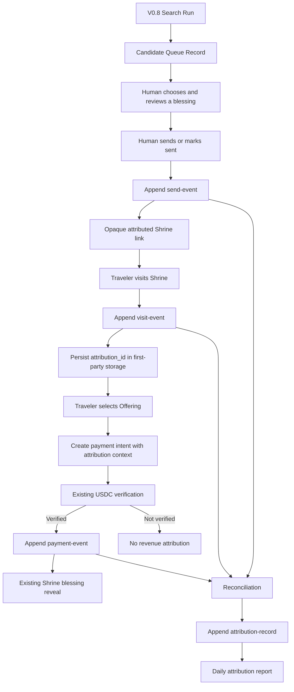
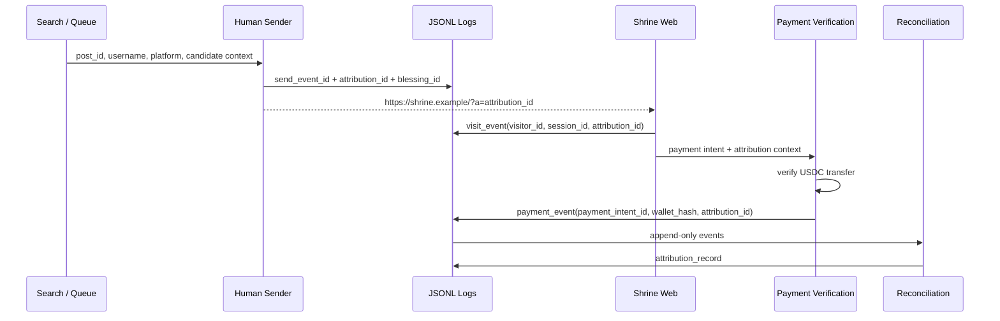
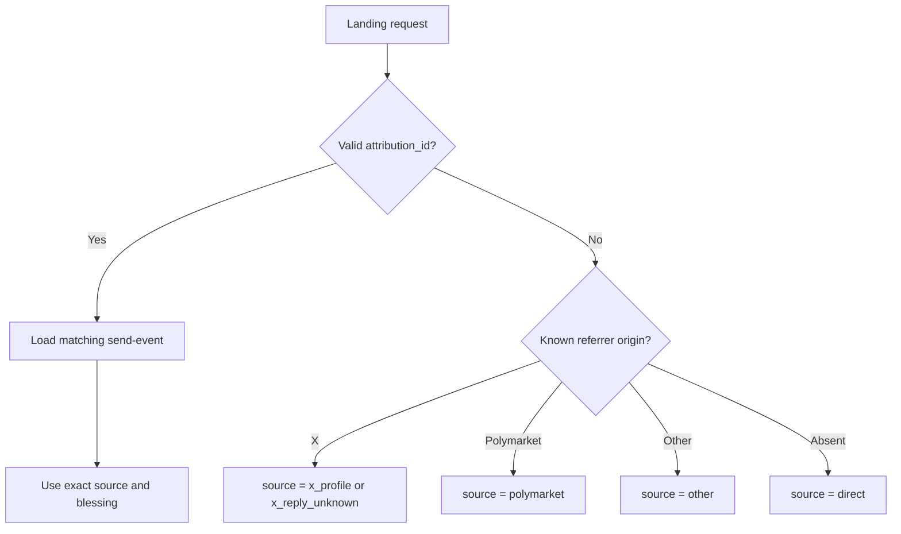

# Fortune Shrine Attribution Data Flow

Status: architecture design only  
Version: 1.0

## Complete Path



The attribution layer observes existing stages. It does not alter candidate
discovery, blessing generation, human confirmation, payment verification, or
blessing release.

## Identifier Flow



## Stage 1 — Search

Existing source:

```text
scripts/distribution/v08/output/fresh-targets-*.json
```

Relevant fields:

```text
username
platform
community
post_id
post_url
freshness_score
discovered_at
```

No attribution event is required merely because a candidate was found.

## Stage 2 — Send

Trigger:

```text
Human confirms that a specific blessing was actually sent.
```

Write:

```text
/data/attribution/send-events.jsonl
```

Required join keys:

```text
send_event_id
attribution_id
post_id
platform_user_id or username
blessing_id
```

The send event is the only event that contains the operational public identity.

## Stage 3 — Visit

Trigger:

```text
Shrine landing page loaded.
```

Write:

```text
/data/attribution/visit-events.jsonl
```

Resolution:

```text
valid ?a= ID
→ attributed visit

known safe referrer without ?a=
→ source-level visit only

no evidence
→ direct / unattributed
```

The visit event must not include raw IP or browser fingerprint.

## Stage 4 — Payment

Trigger:

```text
Existing payment verification changes the intent to verified.
```

Write:

```text
/data/attribution/payment-events.jsonl
```

The payment event is written after verification, never when the payment modal
opens or a transaction is merely submitted.

Required deduplication key:

```text
verified_signature
```

## Stage 5 — Shrine Blessing

The blessing revealed after payment remains part of the existing Shrine memory
record.

Attribution stores its identifier separately:

```text
shrine_blessing_id
```

It must not overwrite:

```text
outbound_blessing_id
```

The first is what the traveler received inside the Shrine. The second is what
preceded the visit.

## Stage 6 — Reconciliation

Input:

```text
send-events.jsonl
visit-events.jsonl
payment-events.jsonl
```

Join order:

```text
attribution_id
→ visitor_id
→ session_id
→ payment_intent_id
→ verified_signature
```

Output:

```text
/data/attribution/attribution-records.jsonl
```

States:

```text
sent_only
visited
payment_started
paid
unattributed
orphaned
voided
```

## Source Decision Flow



Only branch C supports blessing-level payment attribution.

## Failure Boundaries

| Failure | Required behavior |
| --- | --- |
| Send event cannot be written | Warn operator; do not invent attribution |
| Visit event cannot be written | Shrine remains usable |
| Invalid `attribution_id` | Record rejected format; classify visit independently |
| Payment event append fails | Payment and blessing still complete; dead-letter the event |
| Duplicate payment callback | Ignore duplicate verified signature |
| Missing send event | Mark attribution `orphaned` |
| No attribution evidence | Mark `unattributed`, never guess |

## Storage Flow

```text
Append event
→ newline-delimited JSON
→ monthly rotation
→ read-only reconciliation
→ atomic daily summary
```

No message broker, warehouse, database cluster, or external tracking pixel is
required for V1.
