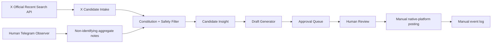

# Fortune Shrine Phase 1 Approval Workflow

Date: 2026-06-22  
Status: Research and architecture only  
Posting: Manual only

## Goal

Create a safe workflow:

```text
Observe
→ identify a relevant state
→ create candidate insight
→ draft a possible reply
→ human review
→ human manually posts in the native platform
→ human records the result
```

Phase 1 does not send anything.

## Feasibility Summary

| Platform | Automated read | AI analysis | Draft generation | Manual posting | Phase 1 verdict |
|---|---|---|---|---|---|
| X | Yes, official API | Feasible under applicable X terms | Feasible | Required | Recommended |
| Telegram | Technically possible, but not acceptable for this AI workflow by default | Blocked by current Telegram API/AI terms without appropriate consent or authorization | Only from human-authored abstract notes | Required | Human-observation-only |

## Architecture



Important:

- Telegram messages do not enter the AI system.
- Telegram notes contain categories and aggregate observations, not copied messages or handles.
- The human must revisit the native platform and write or paste the final reply manually.

## Components

### 1. X Candidate Intake

Official endpoint:

```text
GET /2/tweets/search/recent
```

Capabilities:

- previous seven days;
- keywords and exact phrases;
- language filters;
- exclude reposts;
- return Post, author, time, and public metrics.

Suggested research queries:

```text
("wish me luck" OR "hope this works" OR nervous OR waiting) lang:en -is:retweet
("got liquidated" OR "stopped out" OR "gave it all back") lang:en -is:retweet
("all in" OR "high conviction" OR "can't sleep") (crypto OR trading) lang:en -is:retweet
```

A query match is only a discovery event. It is not evidence that contact is appropriate.

### 2. Telegram Manual Observation Notes

Allowed input:

```json
{
  "community": "GMX Trading Chat",
  "observed_at": "ISO-8601",
  "state": "waiting",
  "frequency": 3,
  "conversation_quality": 8,
  "emotional_honesty": 7,
  "operator_note": "Several members discussed difficulty remaining inactive; no copied text or identifying data."
}
```

Not allowed:

- exact Telegram message;
- username;
- message link;
- screenshot;
- exported chat;
- message-level AI classification.

Under the current boundary, Telegram can inform community strategy but cannot generate person-level AI candidate replies.

### 3. Constitutional Filter

Reject a candidate if the intended reply would:

- bless profit or winning;
- encourage a trade or bet;
- offer financial advice;
- exploit severe distress;
- mention recovery of losses as a promise;
- introduce the Shrine where no relationship exists;
- look like keyword-triggered marketing.

### 4. Candidate Insight

```json
{
  "candidate_id": "CAN-...",
  "platform": "X",
  "source_id": "post-id",
  "source_url": "https://x.com/.../status/...",
  "author": "@handle",
  "created_at": "ISO-8601",
  "captured_at": "ISO-8601",
  "state": ["waiting", "fear"],
  "state_evidence": "Short explanation",
  "contact_safety": "safe|review|exclude",
  "why_reply_may_be_natural": "Human rationale",
  "status": "draftable"
}
```

### 5. Draft Generator

Inputs:

- exact public X Post;
- state labels;
- platform context;
- Constitution.

Outputs:

- three short drafts;
- no link;
- no product mention;
- no result prediction;
- a plain-language rationale;
- a risk flag.

The generator does not decide to contact.

### 6. Approval Queue

Required actions:

- `APPROVE_FOR_MANUAL_USE`
- `REJECT`
- `EXCLUDE_SENSITIVE`
- `STALE`

Approval means:

> A human believes this draft is contextually appropriate to consider using.

Approval does not trigger posting.

### 7. Manual Post and Result Log

The human:

1. opens the original Post in X or the conversation in Telegram;
2. confirms it still exists and context has not changed;
3. edits the draft in their own voice;
4. posts using the native interface;
5. records the outcome manually.

## Storage

MVP local files:

```text
phase1/
  x-candidates.jsonl
  telegram-community-notes.jsonl
  approval-queue.json
  manual-send-events.jsonl
  exclusions.jsonl
```

Do not store:

- passwords;
- Telegram session files;
- X access tokens in JSON;
- private messages;
- deleted Post text beyond required compliance retention;
- crisis content.

## Required Permissions

### X read

- developer account;
- Project and App;
- Bearer Token for app-only public read;
- API access level supporting Recent Search.

### X manual posting

No programmatic write permission is required in Phase 1.

### Telegram

- ordinary user membership granted through normal group rules;
- no API credentials;
- no bot;
- no exported session;
- no automation permission.

## Tools

Recommended:

- X API Recent Search;
- local JSONL;
- deterministic filters;
- local approval page;
- clipboard button;
- manual browser/native-client posting;
- manual send-event form.

Not recommended:

- X website scripting;
- Telegram userbot;
- Telegram Desktop UI scripting;
- Telegram chat export ingestion;
- browser cookie reuse;
- automated DMs;
- automatic reply submission.

## Risks

### Platform risk

- X prohibits unsolicited keyword-based automated replies.
- X warns against non-API website scripting.
- Telegram blocks Telegram data use in AI-system deployment under current API terms.

### Human risk

- interpreting dark humor as distress;
- replying to someone in crisis;
- blessing an outcome rather than a state;
- sounding generated;
- entering a support thread as marketing.

### Data risk

- retaining deleted X content;
- storing more personal information than needed;
- copying Telegram conversations into the project;
- leaking tokens or sessions.

## Phase 1 Acceptance Criteria

- X candidate discovery uses the official API.
- Every candidate has an exact Post URL and timestamp.
- Telegram contributes only community-level manual notes.
- Every draft has a human-readable reason and safety status.
- Approval never sends.
- Final posting is manual.
- No automated DM, follow, like, repost, or reply exists.
- Every actual send is recorded by the operator.

## Official References

- [X Search Posts](https://docs.x.com/x-api/posts/search/introduction)
- [X OAuth 2.0](https://docs.x.com/fundamentals/authentication/oauth-2-0/overview)
- [X Automation Rules](https://help.x.com/en/rules-and-policies/x-automation)
- [Telegram API Terms](https://core.telegram.org/api/terms)

