# Fortune Shrine Phase 2 Approval Posting System

Date: 2026-06-22  
Status: Feasibility and architecture research only  
Implementation: Not authorized

## Goal

Research a human-controlled system:

```text
Read
→ identify
→ draft
→ show approval queue
→ human explicitly approves one item
→ system posts one item
→ log the result
```

No autonomous posting, scheduling, retrying, continuous sending, or bulk approval.

## Executive Verdict

### X

**Conditionally feasible through the official X API.**

The safe technical path is:

- official X Recent Search for discovery;
- AI-assisted drafting;
- human reviews the full context and final text;
- a separate `Send` action;
- official X API write endpoint using user-context OAuth;
- one reply at a time;
- no automatic retry.

However:

- keyword-triggered unsolicited automated replies are prohibited;
- AI-powered automated reply bots require prior written, explicit X approval;
- scripting the X website can result in permanent suspension.

Therefore Phase 2 must behave as an operator-controlled publishing tool, not an auto-reply bot.

### Telegram

**Not recommended under the current design.**

The intended pipeline requires AI to read Telegram conversations and draft replies. Telegram’s current API terms prohibit using or aggregating Telegram data for AI-system development or deployment.

Without explicit platform authorization and appropriate user consent:

- do not connect Codex to Telegram messages;
- do not build a userbot;
- do not automate Telegram Web or Desktop;
- do not send AI-derived Telegram replies.

Telegram remains manual-native-client only.

## Platform Feasibility Matrix

| Capability | X official API | X browser automation | Telegram Bot API | Telegram user API | Telegram Web/Desktop automation |
|---|---|---|---|---|---|
| Read relevant public content | Yes | Technically | Only chats bot can access | Technically | Technically |
| Feed content to AI | Subject to X terms | Subject to X terms | Blocked by Telegram AI terms by default | Blocked by Telegram AI terms by default | High legal/policy risk |
| Human approval queue | Yes | Yes | Technically | Technically | Technically |
| Post after one explicit approval | Yes, user OAuth | Not recommended/prohibited scripting risk | Only as bot where admitted | Technically risky | Fragile/high risk |
| Reuse login session | OAuth refresh token | Browser cookies | Bot token | MTProto session | Browser/desktop session |
| Account-safety posture | Best available | Poor | Visible bot identity | High scrutiny | Fragile |
| Recommendation | Conditional yes | No | No for this project | No | No |

## Recommended X Architecture

```mermaid
flowchart LR
    XS["X Recent Search API"] --> IN["Candidate intake"]
    IN --> SF["Safety + Constitution filter"]
    SF --> DR["Three draft replies"]
    DR --> AQ["Approval queue"]
    AQ --> AP["Approve state only"]
    AP --> SC["Separate Send confirmation"]
    SC --> XV["Re-fetch original Post"]
    XV --> API["POST /2/tweets via user OAuth"]
    API --> LG["Immutable send-event log"]
```



## State Machine

```text
discovered
→ drafted
→ approved
→ send_ready
→ sent

Alternative exits:
rejected
sensitive_excluded
stale
failed
unconfirmed
revoked
```

Rules:

- `Approve` changes state only.
- `Send` is a separate, deliberate action.
- only one `send_ready` item can be active;
- the original Post is re-fetched immediately before send;
- text is shown in full at confirmation;
- no background send;
- no automatic retry;
- no batch selection.

## X Authentication

### Read

App-only Bearer Token:

- public read;
- app-level rate limits;
- no user is involved.

### Write

User-context authentication:

- OAuth 2.0 Authorization Code with PKCE or supported user token;
- minimum required scopes only;
- write access required for creating a Post;
- refresh token stored encrypted where applicable;
- account owner can revoke access.

The Create Post endpoint is:

```text
POST /2/tweets
```

A reply payload must identify the original Post through the API’s reply field. Exact current payload shape must be validated against the live API reference during implementation.

## X Approval Screen

Required fields:

- original author;
- original Post;
- exact URL;
- Post age;
- context/thread preview;
- safety flags;
- draft A/B/C;
- editable final text;
- reason selected;
- confirmation that no link/product mention exists;
- `Approve`;
- `Reject`;
- separate `Send now`.

Before `Send now`, show:

```text
This will publish one public reply from @account.
It will not be retried automatically.
```

## X Safety Controls

### Hard controls

- one send per confirmation;
- one account per queue;
- no scheduled replies;
- no automatic mention expansion;
- no DMs;
- no likes/follows;
- no duplicated text;
- no posting when authentication changes;
- no retry after 401, 403, 429, or ambiguous timeout;
- global kill switch;
- daily human-set limit;
- immutable audit event.

### Context controls

Exclude:

- severe crisis or self-harm language;
- minors;
- private or deleted content;
- protected accounts;
- support/security emergencies;
- profanity or sensitive media unless explicitly safe;
- explicit request not to be contacted;
- trades where the draft could imply direction or certainty.

### Anti-spam controls

- candidate discovery cannot alone authorize contact;
- human must explain why the reply is useful in context;
- repeated drafts fail approval;
- one reply per original interaction;
- no cross-account duplication;
- stale candidates expire;
- no “reply to everyone matching a keyword.”

## Why X Browser Automation Is Rejected

X’s official automation rules say not to use non-API automation such as scripting the website and warn this may lead to permanent account suspension.

Therefore do not use:

- Playwright to click Reply;
- browser extensions that submit replies;
- injected scripts;
- simulated typing followed by automated click;
- Chrome DevTools Protocol for posting;
- cookie/session automation.

A convenience tool may open the original URL or copy approved text, but the moment it programmatically manipulates or submits the X composer it enters the rejected path.

## Telegram Options

### Telegram Bot API

Technical facts:

- a bot sees only the messages allowed by its membership, admin status, and privacy mode;
- a bot is visibly a bot;
- a bot must be added to each group;
- moderators control its permissions.

Why it does not fit:

- the directive says no bots;
- target communities have not opted in;
- the intended AI analysis conflicts with Telegram’s current AI-data restriction;
- a bot would damage the human-presence strategy.

Verdict: **Do not implement.**

### Telegram User API / MTProto

Technical facts:

- requires an `api_id` and `api_hash`;
- authenticates a real user account;
- unofficial client logins are monitored;
- Telegram states flooding/spamming can lead to permanent bans.

Additional blocker:

- platform data cannot be fed into the proposed AI workflow under current terms.

Verdict: **Do not implement without written platform authorization, legal review, and a redesigned consent model.**

### Telegram Desktop

Session persistence:

- local Desktop session files keep the user logged in;
- those files are effectively sensitive credentials;
- copying or sharing the session profile creates account-takeover risk.

UI automation risks:

- fragile selectors and window focus;
- accidental send to the wrong chat;
- no stable official automation contract;
- difficult auditability;
- potential anti-abuse triggers;
- message content would still be entering an AI-assisted automation pipeline.

Verdict: **Manual use only.**

### Telegram Web

Session persistence:

- browser cookies and local storage preserve login;
- profile reuse exposes session credentials;
- multi-profile confusion can send from the wrong account.

UI automation risks:

- DOM changes;
- hidden/virtualized message nodes;
- reply-target drift;
- accidental send;
- no official supported automation path;
- terms issue remains.

Verdict: **Manual use only.**

## Compliant Telegram Phase 2 Alternative

Until the terms or consent basis changes:

```text
Human reads Telegram natively
→ human decides whether to respond
→ human writes the response
→ human sends it natively
→ human records only a minimal event
```

Codex may assist with general communication principles without seeing the Telegram message or identifying the member.

Example safe prompt:

> Give me three non-promotional ways to acknowledge uncertainty without predicting an outcome.

Unsafe prompt:

> Here is a Telegram member’s full message and username; draft a targeted reply.

## Event Log

```json
{
  "event_id": "SEND-...",
  "platform": "X",
  "candidate_id": "CAN-...",
  "source_id": "post-id",
  "approved_by": "operator",
  "approved_at": "ISO-8601",
  "sent_by": "operator",
  "send_requested_at": "ISO-8601",
  "result": "sent|failed|unconfirmed",
  "platform_message_id": "reply-id",
  "error_class": null,
  "automatic_retry": false
}
```

Never log:

- access tokens;
- cookies;
- Telegram sessions;
- private messages;
- wallet information;
- sensitive distress content.

## Failure Handling

### 401

- stop;
- mark authentication failure;
- require manual reauthorization;
- do not retry automatically.

### 403

- stop;
- record permission/policy failure;
- review account and app permissions.

### 429

- stop the session;
- preserve queue state;
- do not switch accounts;
- do not retry automatically.

### Timeout after send

- mark `unconfirmed`;
- query the authenticated account’s recent Posts or inspect manually;
- never post the same reply again until confirmed absent.

### Account warning or challenge

- disable all write capability;
- revoke active send-ready state;
- require human review before restoration.

## Account-Safety Assessment

### X approved API posting

Risk: **Medium**

Why:

- official API path;
- but unsolicited replies remain sensitive;
- account history, repetition, and user reports matter;
- AI reply-bot operation needs explicit X approval.

### X manual native posting

Risk: **Low–Medium**

Why:

- strongest human control;
- still subject to spam and platform rules;
- safest current operating mode.

### Telegram native manual posting

Risk: **Low–Medium**

Why:

- technically ordinary user behavior;
- community bans remain possible if participation looks promotional.

### Telegram API or UI-assisted AI posting

Risk: **High / currently blocked**

Why:

- AI-data terms conflict;
- account/session sensitivity;
- anti-spam and unofficial-client scrutiny;
- community consent absent.

## Required Permissions Before Any Implementation

### X

- approved developer account;
- Project and App;
- read access;
- user-context OAuth write access;
- correct scopes;
- account owner authorization;
- review of current pricing/rate limits;
- legal/policy review of the human-approved reply model;
- written X approval if the system qualifies as an AI reply bot.

### Telegram

Current permission state is insufficient.

Future implementation would require:

- clear platform authorization for AI use;
- community/admin approval;
- informed user consent where content is processed;
- legal review;
- revised privacy notice;
- secure session architecture;
- explicit reconsideration of the “no bots” product rule.

## Recommended Roadmap

### Now

- Keep X posting manual.
- Use official X API only for read/discovery.
- Run the GMX study manually with aggregate notes.
- Build no Telegram integration.

### Before X Phase 2 implementation

- verify API write access;
- obtain policy advice or X approval if necessary;
- test one private/draft environment where possible;
- implement separate Approve and Send actions;
- define a very low human-set daily cap.

### Before any Telegram implementation

- resolve the AI-data terms blocker;
- secure explicit authorization and consent;
- redesign around opt-in communities;
- only then reconsider a bot or API client.

## Final Recommendation

Build Phase 2 for **X only**, using the official API and explicit one-item human confirmation.

Do not build Telegram approved posting under the present assumptions.

Telegram’s current role should remain:

- human observation;
- relationship research;
- manual participation;
- no AI ingestion;
- no programmatic sending.

## Official References

- [X Search Posts](https://docs.x.com/x-api/posts/search/introduction)
- [X Create Post](https://docs.x.com/x-api/posts/create-post)
- [X OAuth 2.0](https://docs.x.com/fundamentals/authentication/oauth-2-0/overview)
- [X Automation Rules](https://help.x.com/en/rules-and-policies/x-automation)
- [Telegram API Terms](https://core.telegram.org/api/terms)
- [Creating a Telegram Application](https://core.telegram.org/api/obtaining_api_id)
- [Telegram Bots FAQ](https://core.telegram.org/bots/faq)

