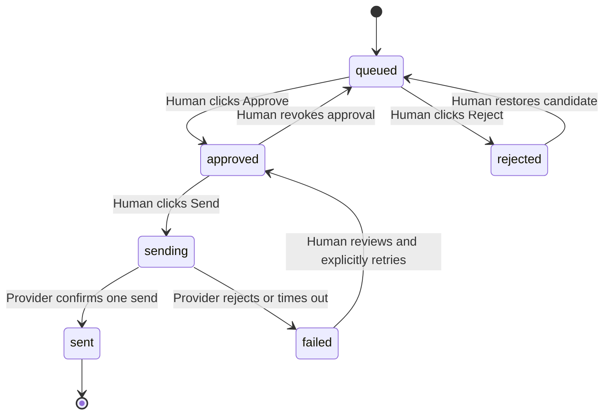

# Fortune Shrine Send Flow

Status: architecture design only  
Date: 2026-06-21

## Objective

Complete the controlled distribution loop:

```text
Candidate Found
→ Queue
→ Generate Blessing
→ Human Approve or Reject
→ Send One Approved Item
→ Record Send Event
```

This flow does not authorize unattended sending, batch sending, automatic approval,
automatic retry, direct messages, follows, likes, or other account actions.

## Current Send Module

The existing V0.7 sender consists of:

```text
V0.6 reply CSV
→ prepare-queue.mjs
→ queue.json / queue.csv
→ local review page
→ Chrome extension
→ X reply composer
→ human clicks Reply
→ human marks sent
→ sent-history.json
```

### Current capabilities

- restores or validates an X post URL
- displays candidate context
- displays three blessing drafts
- allows the operator to choose one draft
- copies the draft
- opens the X post
- attempts to focus and fill the X reply editor
- keeps the final X send action manual
- records a manually marked send

### Current limitations

- no explicit `Approve` action
- no explicit `Reject` action
- selecting a radio button is not durable approval
- no immutable approved-text snapshot
- no approval timestamp or reviewer record
- no `candidate_id`
- no stable `blessing_id`
- no `attribution_id`
- no source-platform field in send history
- no provider response or sent reply URL
- no proof that “mark sent” corresponds to an actual platform send
- no idempotency protection beyond the current local item state
- no controlled failed-send state or failure reason
- no Polymarket send adapter
- the X extension fills drafts but intentionally never clicks Reply

## Proposed State Machine



No automatic transition may enter `approved` or `sending`.

## Stage 1 — Candidate Found

Existing V0.8 output provides:

```text
username
platform
profile_url
community
post_id
post_url
post_created_at
freshness_score
discovered_at
```

At queue import, create:

```text
candidate_id
```

Recommended deterministic format:

```text
candidate_id = SHA-256(platform + ":" + post_id)
```

This prevents duplicate queue items for the same public post without exposing
additional private data.

## Stage 2 — Queue

The queue record should contain:

```json
{
  "candidate_id": "cand_...",
  "username": "traveler",
  "source": "X",
  "post_id": "2068534613102759995",
  "post_url": "https://x.com/traveler/status/2068534613102759995",
  "candidate_text": "Waiting for the result.",
  "queue_status": "queued",
  "queued_at": "2026-06-21T18:00:00.000Z"
}
```

Queueing is not permission to send.

## Stage 3 — Generate Blessing

Generate or load three candidate drafts.

Each exact draft receives a stable ID:

```text
blessing_id = corpus ID
```

or, for generated/edited text:

```text
blessing_id = "b_" + SHA-256(normalized exact text)
```

The operator may edit a draft before approval. Any edit creates a new
`blessing_id`.

Before approval, the draft must pass:

- Constitution check
- no prediction
- no outcome promise
- no financial or gambling advice
- no link unless the operator deliberately enables one
- platform length limit
- non-empty exact text

## Stage 4 — Human Approve or Reject

Every queued item exposes two independent actions:

```text
Approve
Reject
```

### Approve

Approval freezes:

```text
candidate_id
blessing_id
exact blessing text
source
source post ID
approved_at
approved_by
```

Approval does not send.

### Reject

Rejection records:

```text
candidate_id
rejected_at
rejected_by
reason_code
optional note
```

Suggested reason codes:

```text
poor_fit
unsafe_contact
advertising_or_bot
outdated
duplicate
blessing_mismatch
platform_risk
other
```

Rejected candidates cannot enter the sending state unless a human restores them.

## Stage 5 — Send

Only an `approved` item can expose an enabled `Send` action.

Required MVP interaction:

```text
Human opens one approved item
→ system shows exact final text and destination
→ human clicks Send
→ system executes one provider request
→ system waits for provider confirmation
→ system records success or failure
```

The system must not:

- send immediately when Approve is clicked
- process the next queue item automatically
- send more than one item per click
- retry automatically
- change the approved text after approval
- send if the source post or account identity changed

## Stage 6 — Send Event Log

Required record:

```json
{
  "event_id": "evt_...",
  "attribution_id": "atr_...",
  "candidate_id": "cand_...",
  "blessing_id": "b_...",
  "source": "X",
  "send_time": "2026-06-21T18:05:00.000Z",
  "status": "sent"
}
```

Recommended complete record:

```json
{
  "schema_version": "1.0",
  "event_id": "evt_...",
  "attribution_id": "atr_...",
  "candidate_id": "cand_...",
  "blessing_id": "b_...",
  "source": "X",
  "source_post_id": "2068534613102759995",
  "source_post_url": "https://x.com/traveler/status/2068534613102759995",
  "username": "traveler",
  "approved_at": "2026-06-21T18:03:00.000Z",
  "send_time": "2026-06-21T18:05:00.000Z",
  "status": "sent",
  "provider_message_id": "2068540000000000000",
  "provider_message_url": "https://x.com/FortuneShrine/status/2068540000000000000",
  "error_category": null,
  "error_message": null
}
```

Storage:

```text
send-events.jsonl
```

Each state-changing attempt is append-only. Derived current state may be written to
an atomically replaced JSON file.

## Send Success Definition

`sent` requires provider evidence:

For an official API:

```text
HTTP success
+ provider message ID
```

For browser-assisted sending:

```text
visible sent reply
+ recoverable public reply URL or provider message ID
```

The operator clicking “mark sent” alone is not provider confirmation.

If confirmation cannot be obtained:

```text
status = unconfirmed
```

Do not count `unconfirmed` as sent.

## Idempotency

Every approved send receives:

```text
send_request_id
```

Before sending:

1. Look for any `sent` event with the same `candidate_id`.
2. Look for an in-flight request with the same `send_request_id`.
3. Refuse duplicate execution unless the prior attempt is explicitly failed and
   the human approves a retry.

Default rule:

```text
one public post
→ at most one Fortune Shrine reply
```

## Future Auto Approve Interface

Not implemented in MVP.

Reserve an approval-policy result:

```json
{
  "candidate_id": "cand_...",
  "policy_version": "future",
  "recommendation": "approve",
  "confidence": 0.91,
  "reasons": ["safe_contact", "state_match"],
  "can_execute": false
}
```

The critical field remains:

```text
can_execute = false
```

Future recommendations may pre-sort the review queue, but they must not transition
an item to `approved` without a separately authorized policy change.
